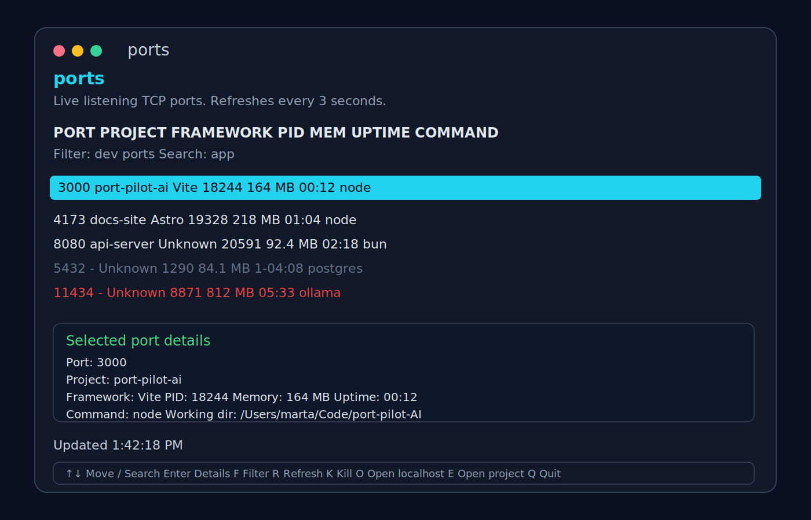

# ports

`ports` is a TypeScript CLI for inspecting what is listening on your machine's TCP ports.



## Features

- `ports` opens an interactive Ink TUI with live refresh
- `ports list` prints a static table
- `ports check <port>` shows detailed information for one port
- `ports kill <port>` kills the process listening on that port
- Project and framework detection from the nearest `package.json`

## Setup

```bash
npm install
npm run build
npm link
```

Then run:

```bash
ports
ports list
ports check 3000
ports kill 3000
```

## TUI shortcuts

- `↑` / `↓`: move selection
- `/`: search by project, command, or port
- `f`: cycle filter modes
- `r`: refresh now
- `enter`: toggle details for selected port
- `k`: kill selected process
- `o`: open `localhost:PORT` in the browser
- `e`: open the project in Cursor or VS Code
- `q`: quit
